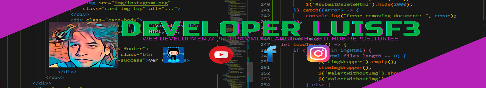

### Hi there 👋

- 🔭 I’m currently working on Agfer.
- 🌱 I’m currently learning JavaScript.
- 👯 I’m looking to collaborate on Google.
- 💬 Ask me about developerluisf3@outlook.com
- 📫 How to reach me:

**►** 🌐 **Mis redes sociales:**

- ✔️ 👀 👉 [Facebook](https://www.facebook.com/Developer-LuisF3-231261368847638 "Facebook")
- ✔️ 👀 👉 [Instagram](https://www.instagram.com/developer_luisf3/?hl=es "Instagram")
- ✔️ 👀 👉 [YouTube](https://www.youtube.com/channel/UCUe93GaLtWWz_c2vbhlFP9A "YouTube")
- ✔️ 👀 👉 [CodeSandbox](https://codesandbox.io/u/DeveloperLuisF3 "CodeSandbox")
- ✔️ 👀 👉 [Git/Hub](https://github.com/DeveloperLuisF3?tab=repositories "Git/Hub")

<!--
**DeveloperLuisF3/developerluisf3** is a ✨ _special_ ✨ repository because its `README.md` (this file) appears on your GitHub profile.

Here are some ideas to get you started:

- 🔭 I’m currently working on ...
- 🌱 I’m currently learning ...
- 👯 I’m looking to collaborate on ...
- 🤔 I’m looking for help with ...
- 💬 Ask me about ...
- 📫 How to reach me: ...
- 😄 Pronouns: ...
- ⚡ Fun fact: ...
-->
